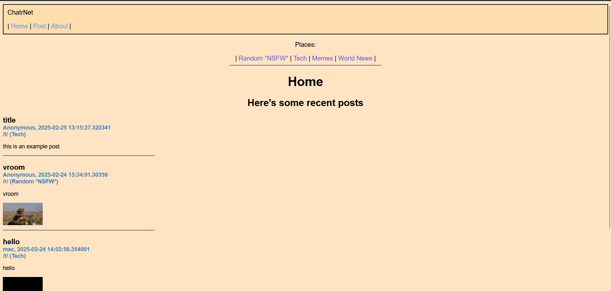

# ChatrNet
- Uses Python Flask Framework to build a simple social networking site
- Utilizes SQLAlchemy and SQLite DB files to store data when a user posts
- Homepage, with 4 most recent posts
- By default, ChatrNet has 4 "places". When a user posts, they choose what place they want to post
- A place can easily be added by including a new dictionary item in 'place_list'. Dictionary key is what shows in the URL, the dictionary item is the name of the place

